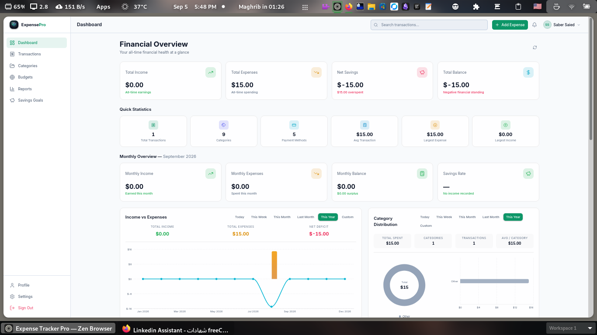
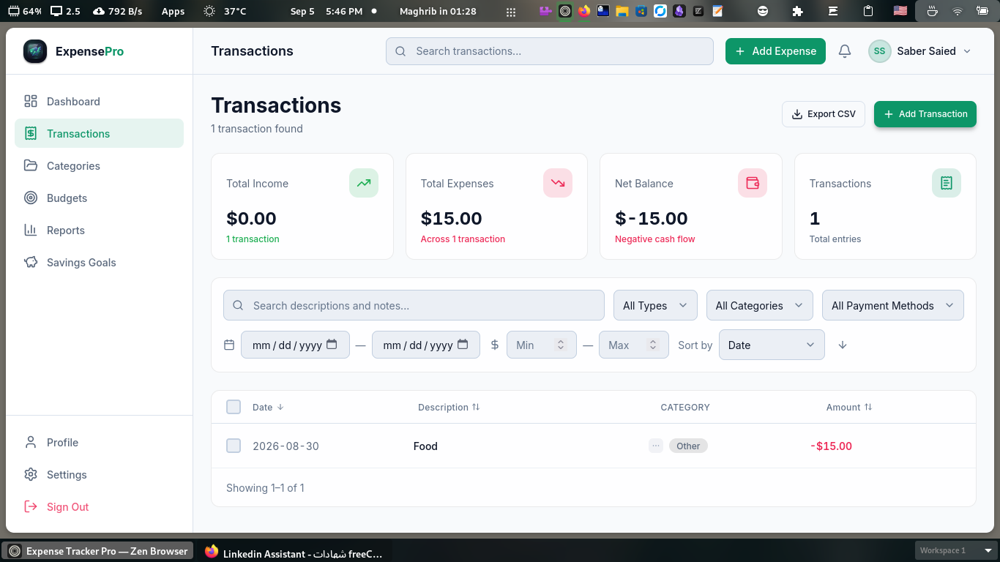
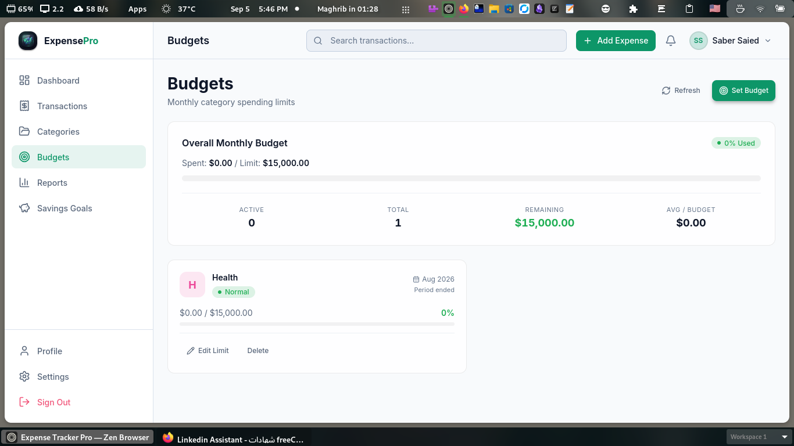
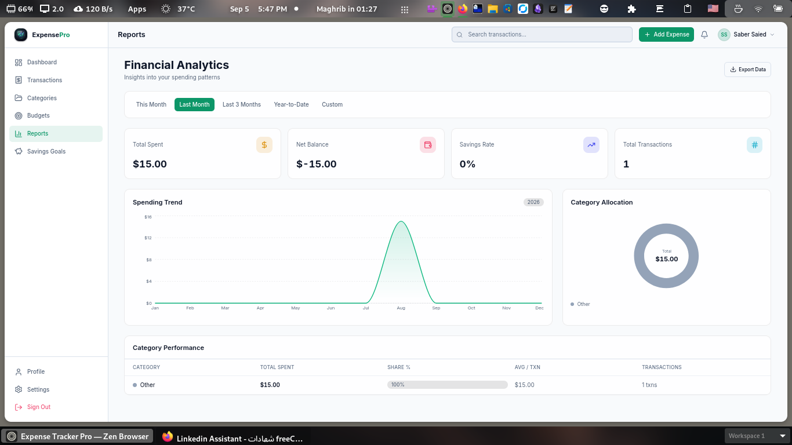
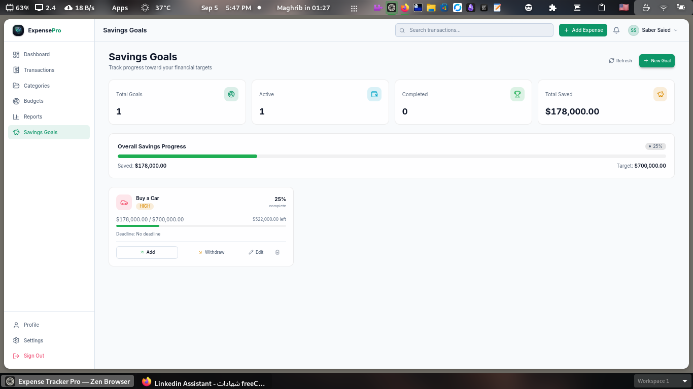
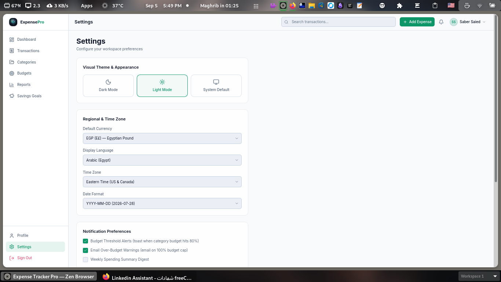
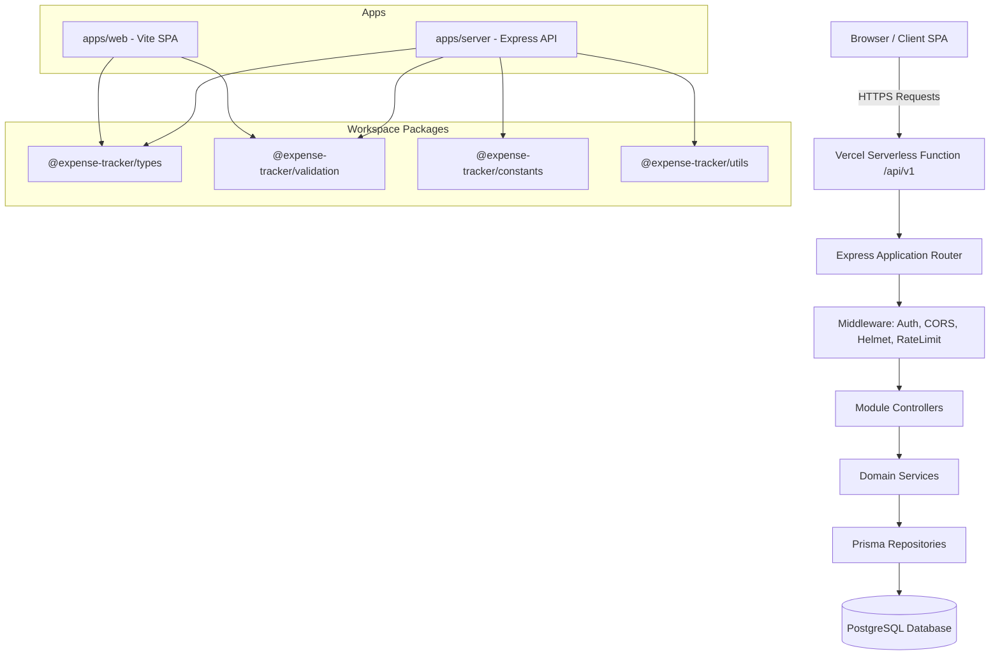
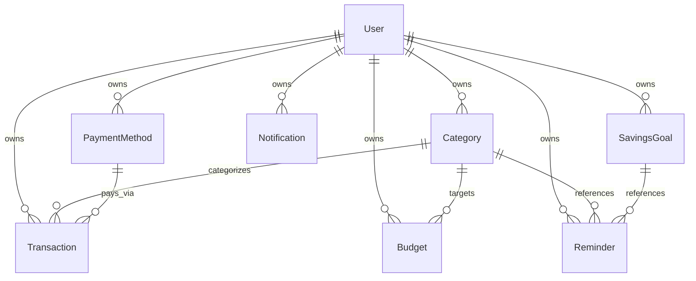
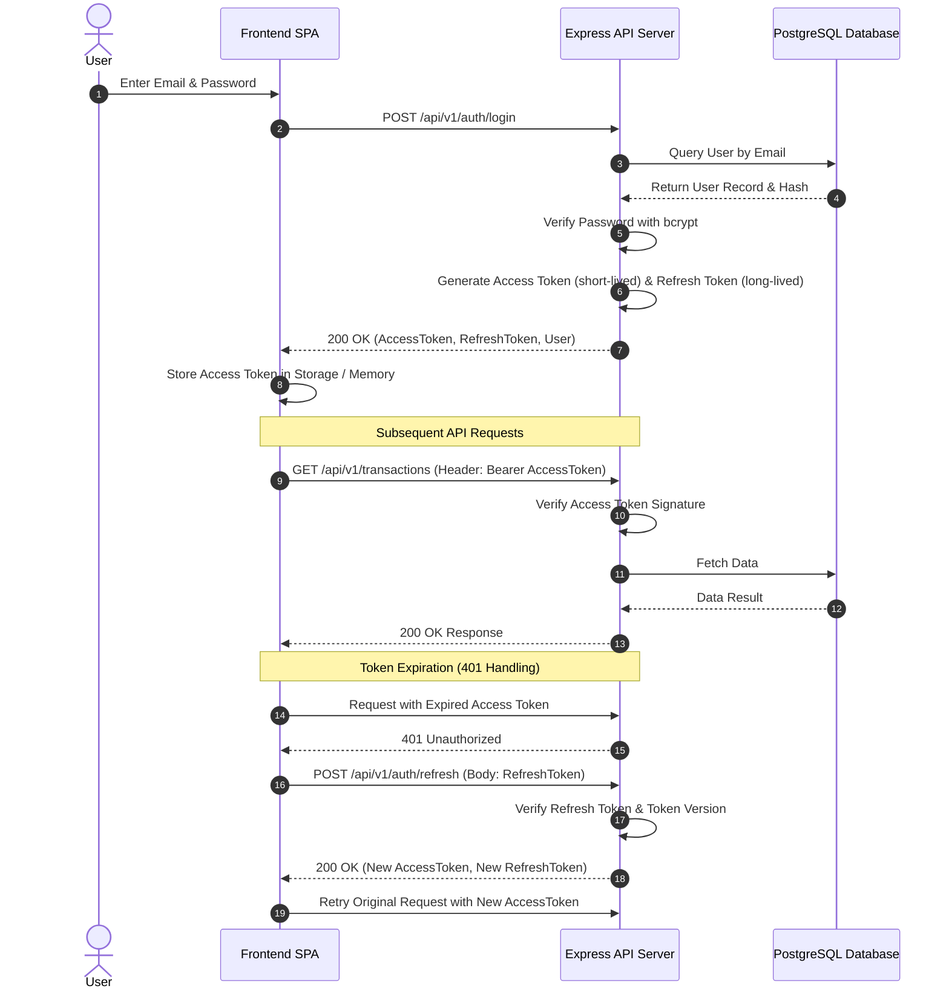

# Expense Tracker Pro

> Production-grade, full-stack monorepo application for personal and small business financial management.
>
> 🚀 **Live Demo**: [https://expense-tracker-pro-mocha.vercel.app/](https://expense-tracker-pro-mocha.vercel.app)

[](https://expense-tracker-pro-ten-sandy.vercel.app/)
[](https://www.typescriptlang.org/)
[](https://react.dev/)
[](https://expressjs.com/)
[](https://www.prisma.io/)
[](https://www.postgresql.org/)
[](https://pnpm.io/)
[](LICENSE)

---

## Overview

### Problem Statement
Personal finance management applications often fail on two extremes: they are either oversimplified spreadsheets lacking domain validation and reporting, or monolithic legacy systems with poor user experiences, slow response times, and unmaintainable codebases. 

### Target Audience
Expense Tracker Pro is designed for individuals, freelancers, and small teams requiring structured financial ledger tracking, automated budget health monitoring, analytical category breakdowns, and exportable audit reports.

### Purpose & Technical Justification
This repository serves as a showcase of modern software engineering principles. Built as a decoupled TypeScript monorepo, it demonstrates:
- Strict multi-layer architectural boundaries separating HTTP handlers, service domain logic, and data repositories.
- End-to-end type safety shared across workspace packages (`@expense-tracker/types`, `@expense-tracker/validation`, `@expense-tracker/constants`, `@expense-tracker/utils`).
- Resilient database interactions utilizing PostgreSQL parameterized queries, explicit transaction boundaries, and Prisma ORM indexing.
- Serverless deployment capabilities on Vercel combining static SPA frontend hosting with Express serverless API execution.

---

## Features

### Authentication & User Management
- Secure user registration and session management via dual-token JWT (Access Token + HttpOnly/Bearer Refresh Token).
- Password hashing utilizing bcrypt with configurable cost factors.
- Soft account deactivation and permanent account deletion flows with strict confirmation.
- Profile personalization including currency preference, locale, date formatting, dark/light theme, and custom avatar uploads.

### Transactions Management
- Complete CRUD functionality for `INCOME`, `EXPENSE`, and `TRANSFER` record types.
- Paginated ledger listing with multi-attribute filtering (category, date range, payment method, amount ranges, search queries).
- Support for receipt image attachments (JPEG, PNG, WebP) with file validation.
- Atomic bulk operations for batch deleting or batch updating transaction categories.

### Categories & Classification
- Predefined protected system categories alongside user-defined custom categories.
- Unique constraint enforcement per user to prevent duplicate category labels.
- Lucide icon identifier mapping and custom hex color assignments.

### Budgets & Target Tracking
- Multi-period budget allocation (`WEEKLY`, `MONTHLY`, `QUARTERLY`, `YEARLY`).
- Automated calculation of spent totals, remaining balances, and percentage utilization.
- Configurable alert thresholds (e.g., 80% threshold trigger) generating automated notifications.

### Savings Goals & Milestones
- Progress tracking against target savings goals with priority levels (`LOW`, `MEDIUM`, `HIGH`, `CRITICAL`).
- Visual metrics detailing target dates, percentage completed, and current accumulated balance.

### Analytics & Reports
- Monthly and annual spending trends analyzed via Recharts visualizations.
- Interactive category expense breakdown, income-vs-expense ratio metrics, and cash flow velocity charts.

### Data Export & Auditing
- On-demand generation and streaming of structured financial reports in CSV, PDF, and XLSX formats.
- Parsing of HTTP `Content-Disposition` headers for client-side download streams.

### Notifications & System Alerts
- Deduplicated in-app notification engine preventing duplicate notifications via composite database indexes `(userId, dedupKey)`.
- System alerts for budget threshold breaches, bill due dates, and recurring reminders.

### Search & Global Filtering
- High-performance text search across transaction descriptions, merchant notes, and amounts.

---

## Screenshots

| View | Screenshot |
| --- | --- |
| **Dashboard** |  |
| **Transactions Ledger** |  |
| **Budget Management** |  |
| **Reports & Analytics** |  |
| **Savings Goals** |  |
| **User Settings** |  |

---

## Tech Stack

| Layer | Technology | Version | Purpose |
| --- | --- | --- | --- |
| **Frontend Core** | React | 19.0.0 | User interface library |
| **Build Tooling** | Vite | 8.1.1 | High-speed ESM frontend bundler |
| **Language** | TypeScript | 6.0.2 | Strict static typing across entire workspace |
| **Styling** | Tailwind CSS | 4.3.3 | Utility-first CSS framework |
| **Routing** | React Router | 7.18.1 | Client-side routing and layout management |
| **State Management** | Zustand | 5.0.14 | Lightweight client-side reactive store |
| **Form & Validation** | Zod | 3.25.76 | Runtime schema parsing & validation |
| **Charts & Data Visualization** | Recharts | 3.10.1 | Composability-driven chart rendering |
| **Backend Core** | Express | 5.1.0 | HTTP application framework |
| **Database** | PostgreSQL | 16.0 | Relational database management system |
| **Database Adapter / ORM** | Prisma ORM (`@prisma/adapter-pg`) | 7.9.0 | Type-safe database queries & migrations |
| **Security & Utilities** | Helmet, CORS, express-rate-limit, bcrypt | Latest | Security headers, rate limiting, and hashing |
| **Package Manager** | pnpm | 10.33.2 | High-efficiency workspace package manager |
| **Deployment** | Vercel | V2 | Unified monorepo serverless deployment |

---

## Architecture

### Monorepo Architecture Overview
The codebase is structured as a pnpm monorepo separated into `apps/` (runnable applications) and `packages/` (shared domain packages).



### Architectural Principles
1. **Layer Separation**: API routes (`/routes`) contain no business logic. Controllers process HTTP params/query inputs, delegate logic to domain services (`/services`), and return structured JSON responses.
2. **Database Isolation**: Database operations occur exclusively inside repository implementations via Prisma. UI components and controllers never interact with Prisma or SQL directly.
3. **Single Responsibility**: Every service class and utility function fulfills a single domain responsibility.
4. **Shared Type Boundaries**: Request schemas (Zod) and response types are shared from `@expense-tracker/validation` and `@expense-tracker/types` to ensure client and server stay aligned.

---

## Project Structure

```
expense-tracker-pro/
├── api/
│   └── index.ts                 # Vercel Serverless Function entry point
├── apps/
│   ├── server/                  # Backend Express REST API application
│   │   ├── prisma/              # Prisma schema definition, migrations, and seeds
│   │   └── src/
│   │       ├── common/          # Shared Express middleware, errors, and utilities
│   │       ├── config/          # Environment configuration, CORS, Helmet, Logger
│   │       ├── db/              # Prisma client initialization & database adapters
│   │       ├── modules/         # Domain feature modules (auth, transactions, budgets...)
│   │       │   ├── auth/
│   │       │   ├── budgets/
│   │       │   ├── categories/
│   │       │   ├── dashboard/
│   │       │   ├── exports/
│   │       │   ├── jobs/
│   │       │   ├── notifications/
│   │       │   ├── payment-methods/
│   │       │   ├── reports/
│   │       │   ├── savings-goals/
│   │       │   ├── transactions/
│   │       │   └── users/
│   │       ├── app.ts           # Express app setup and middleware configuration
│   │       └── index.ts         # Standalone HTTP server runner
│   └── web/                     # Frontend Single Page Application
│       ├── public/              # Static public web assets
│       └── src/
│           ├── components/      # Reusable UI component library (modals, inputs, buttons)
│           ├── context/         # React Context providers (AuthContext)
│           ├── pages/           # Application route view components
│           ├── services/        # Client HTTP API client abstractions
│           └── utils/           # Client-side helpers and error formatters
├── packages/                    # Workspace packages
│   ├── constants/               # System-wide enum values and defaults
│   ├── types/                   # TypeScript interfaces and API payload types
│   ├── utils/                   # Shared utility functions
│   └── validation/              # Shared Zod validation schemas
├── docs/                        # Architecture specs, FRS, UI wireframes, and design rules
├── package.json                 # Root monorepo workspace package configuration
├── pnpm-workspace.yaml          # pnpm monorepo workspace definition
├── tsconfig.base.json           # Shared base TypeScript configuration
└── vercel.json                  # Monorepo serverless deployment & cron routing
```

---

## Database Design

The PostgreSQL database schema is managed declaratively through Prisma ORM.

### Entity Relationship Summary



### Key Models & Indexes
- **`User`**: Core account model. Contains unique email, hashed password, preferences JSON, and relation constraints (`onDelete: Cascade`).
- **`Transaction`**: High-volume transaction entries. Indexes on `(userId, date)`, `(userId, type, date)`, and `(userId, categoryId)` optimize date-range queries and category filtering.
- **`Budget`**: Category spending caps. Enforces a composite unique index `@@unique([userId, categoryId, startDate])` preventing duplicate budgets per period.
- **`Notification`**: Deduplicated notification log. Uses a composite unique index `@@unique([userId, dedupKey])` preventing concurrent scheduled jobs from inserting duplicate alerts.

---

## API Overview

All API endpoints reside under the `/api/v1` base route. Below is an abbreviated overview of core resource routes:

### Authentication (`/api/v1/auth`)
- `POST /auth/register` — Register a new user account.
- `POST /auth/login` — Authenticate and receive JWT access & refresh tokens.
- `POST /auth/refresh` — Issue a new access token using a valid refresh token.
- `POST /auth/logout` — Invalidate user tokens.

### User Profile (`/api/v1/users`)
- `GET /users/me` — Fetch current user profile.
- `PATCH /users/me` — Update user attributes and preference JSON.
- `POST /users/me/avatar` — Upload avatar image file.
- `POST /users/me/deactivate` — Soft-deactivate user account.

### Transactions (`/api/v1/transactions`)
- `GET /transactions` — Query paginated transactions with filter parameters.
- `POST /transactions` — Create a new financial transaction.
- `GET /transactions/:id` — Fetch single transaction details.
- `PATCH /transactions/:id` — Update transaction properties.
- `DELETE /transactions/:id` — Delete transaction.
- `POST /transactions/bulk/delete` — Batch delete array of transaction IDs.
- `POST /transactions/:id/receipt` — Attach receipt image.

### Budgets & Categories (`/api/v1/budgets`, `/api/v1/categories`)
- `GET /categories` — List user and system categories.
- `POST /categories` — Create custom category.
- `GET /budgets` — List active budgets with calculated consumption percentages.
- `POST /budgets` — Define or update category budget cap.

### Exports & Scheduled Jobs (`/api/v1/exports`, `/api/v1/jobs`)
- `GET /exports/reports?format=pdf|csv|xlsx` — Stream exported report document.
- `GET /jobs/run-all` — Trigger scheduled background calculations (protected by `JOBS_TRIGGER_TOKEN`).

---

## Authentication Flow

The application implements a dual-token JWT authentication strategy designed for modern web clients:



---

## Installation

### Prerequisites
- **Node.js**: `>= 20.0.0`
- **pnpm**: `>= 10.0.0`
- **PostgreSQL**: `>= 15.0` (or Neon / Supabase hosted instance)

### 1. Clone & Install Dependencies
```bash
git clone https://github.com/SaberSaied/expense-tracker-pro.git
cd expense-tracker-pro
pnpm install
```

### 2. Configure Environment Variables
Copy `.env.example` to `.env` in the root directory:
```bash
cp .env.example .env
```

### 3. Database Migration & Prisma Setup
Generate Prisma Client and apply migrations to your PostgreSQL database:
```bash
# Generate Prisma Client types
pnpm dev:generate

# Run database migrations
pnpm dev:migrate

# (Optional) Seed initial demo data
pnpm dev:seed
```

### 4. Start Development Servers
Run frontend and backend parallel development servers:
```bash
pnpm dev
```
- Frontend Web App: `http://localhost:5173`
- Backend API Server: `http://localhost:4000/api/v1`

---

## Environment Variables

| Variable | Required | Default | Description |
| --- | --- | --- | --- |
| `NODE_ENV` | Yes | `development` | Environment mode (`development`, `production`, `test`) |
| `PORT` | No | `4000` | Local HTTP server port |
| `DATABASE_URL` | Yes | - | PostgreSQL connection URL string |
| `JWT_SECRET` | Yes | - | Secret key used for signing JWT tokens (min 32 chars) |
| `JWT_EXPIRES_IN` | No | `7d` | Access token expiration lifespan |
| `JWT_REFRESH_EXPIRES_IN` | No | `30d` | Refresh token expiration lifespan |
| `CORS_ORIGIN` | No | `http://localhost:5173` | Allowed CORS origins (comma-separated for multiple) |
| `TRUST_PROXY` | No | `1` | Number of reverse proxy hops to trust for rate limiting |
| `JOBS_TRIGGER_TOKEN` | No | - | Secret token protecting scheduled cron endpoints |

---

## Available Scripts

The repository defines scripts at the root level delegating commands to workspace packages via `pnpm`:

```bash
# Start all development processes in parallel
pnpm dev

# Build all workspace packages, server dist, and Vite web bundle
pnpm build

# Execute TypeScript type checking across all workspace packages
pnpm typecheck

# Run linter across all workspace packages
pnpm lint

# Format code with Prettier
pnpm format

# Check formatting compliance
pnpm format:check

# Run unit & integration test suites
pnpm test

# Generate Prisma Client
pnpm dev:generate

# Execute Prisma migrations in dev mode
pnpm dev:migrate

# Seed database with initial development dataset
pnpm dev:seed
```

---

## Deployment

### Vercel Unified Monorepo Deployment
- **Live Production URL**: [https://expense-tracker-pro-ten-sandy.vercel.app/](https://expense-tracker-pro-ten-sandy.vercel.app/)

The project is configured for serverless execution on **Vercel** out-of-the-box:

1. Connect your repository to Vercel.
2. Ensure **Root Directory** is set to `./`.
3. Vercel automatically detects `vercel.json`:
   - Builds static SPA assets to `apps/web/dist`.
   - Routes requests targeting `/api/v1/*` to the Vercel Serverless Function at `api/index.ts`.
   - Provisions Vercel Crons executing `/api/v1/jobs/run-all`.
4. Populate `DATABASE_URL`, `JWT_SECRET`, `JOBS_TRIGGER_TOKEN`, and `CORS_ORIGIN` in Vercel Environment Settings.

### Production Checklist
> [!IMPORTANT]
> - Ensure `DATABASE_URL` uses a serverless connection pooler (e.g. Neon or Supabase connection pooling mode).
> - Generate a secure 64-byte random string for `JWT_SECRET` (`openssl rand -hex 64`).
> - Run `pnpm --filter server prisma migrate deploy` during CI/CD to apply migrations.

---

## Performance Optimizations

1. **Route Code Splitting**: Frontend routes use dynamic imports (`React.lazy`), creating split chunks for heavy components like Recharts and settings views.
2. **Custom Vendor Chunking**: `vite.config.ts` partitions `node_modules` into dedicated, long-lived cached chunks (`charts`, `icons`, `react-vendor`, `utils`).
3. **Database Indexing**: Explicit database indexes on query paths (`[userId, date]`, `[userId, categoryId]`) ensure date range and category queries execute under `O(log N)` index scan time.
4. **Prisma Connection Pooling**: Configured `@prisma/adapter-pg` pool sizes minimize connection overhead in serverless environments.

---

## Security

- **Parameterized Queries**: All database access goes through Prisma ORM, eliminating raw SQL injection vulnerabilities.
- **HTTP Rate Limiting**: `express-rate-limit` enforces IP rate limits (300 requests / 15 min for general endpoints; 20 requests / 15 min for authentication routes).
- **Helmet Security Headers**: Configures security-focused HTTP headers including HSTS, X-Content-Type-Options, and Content-Security-Policy.
- **CORS Protection**: Whitelists configured origins dynamically with explicit support for pre-flight caching (`maxAge: 86400`).
- **Input Sanitization**: Request bodies, queries, and route parameters are validated runtime against strict Zod schemas.

---

## Testing

The project maintains tests covering domain logic, services, and API integration paths:

```bash
# Run unit & integration test suites
pnpm test
```

### Strategy
- **Unit Tests**: Test utility algorithms, Zod validation schemas, and state reducers in isolation.
- **Integration Tests**: Execute HTTP endpoints against test database instances to verify end-to-end service contracts.
- **Strict Verification**: No mocking of business logic or database ORM operations in integration tests.

---

## Development Workflow

- **Branch Naming**: `feature/<description>`, `bugfix/<description>`, `chore/<description>`.
- **Commit Standards**: Conventional Commits convention (`feat:`, `fix:`, `docs:`, `refactor:`, `test:`).
- **Code Quality Gates**: PRs must pass `pnpm typecheck`, `pnpm lint`, and `pnpm test` prior to merge approval.

---

## Roadmap

- [x] Monorepo workspace architecture setup.
- [x] Dual-token JWT authentication flow.
- [x] Core transaction ledger with multi-attribute filtering.
- [x] Budget target tracking with threshold notification alerts.
- [x] Data export streaming (CSV, PDF, XLSX).
- [x] Unified Vercel serverless deployment setup.
- [ ] OAuth2 Social Login Integration (Google, GitHub).
- [ ] Multi-currency exchange rate conversions via external API.
- [ ] Automated receipt parsing via OCR vision models.

---

## Learning Outcomes

This repository demonstrates practical expertise in modern software engineering principles:

- **Clean Architecture & Layering**: Strict separation between presentation, HTTP handling, domain services, and database persistence.
- **End-to-End Type Safety**: Shared types and Zod schemas across client and server workspaces.
- **Database Engineering**: Schema design, constraints, relational indexing, and ORM abstractions using PostgreSQL and Prisma.
- **Security Engineering**: Robust authentication mechanisms, rate-limiting, header hardening, and credential hashing.
- **Production Readiness**: Monorepo build orchestration, environment management, and serverless hosting architecture.

---

## Why This Project Matters

Expense Tracker Pro demonstrates the capability to design, structure, and deliver production-ready software. Instead of relying on ad-hoc code structures or single-file scripts, it reflects real-world engineering standards: maintainable module boundaries, robust error handling, type safety across network boundaries, and deployment resilience. It highlights an engineer's ability to build systems that scale cleanly in team and enterprise settings.

---

## License

Distributed under the MIT License. See [`LICENSE`](LICENSE) for details.
